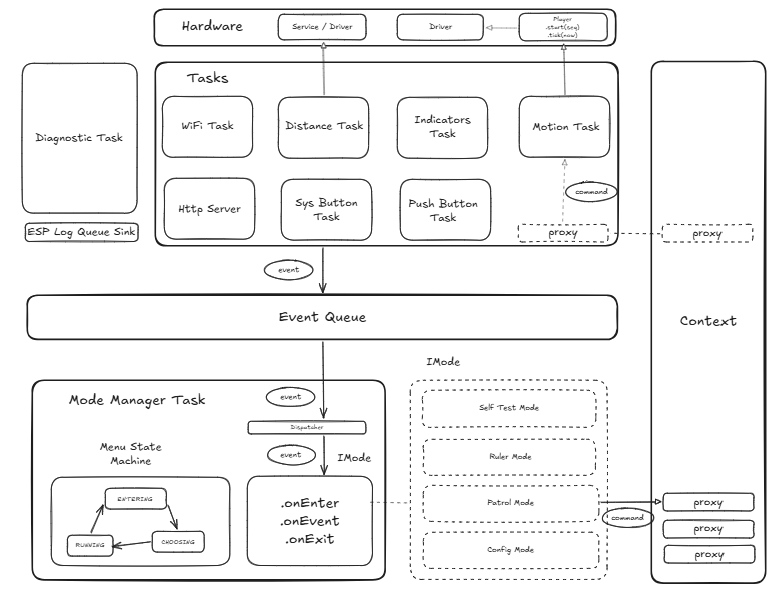

# ESP32 Robot — Architecture Overview

## Concept

This robot is designed as a **mode-based system** rather than a monolithic program. Each behavior is an isolated, self-contained class implementing `IMode`. A central dispatcher activates one mode at a time and routes hardware events to it. This makes it easy to add a new behavior by adding a single mode class and registering it in `main.cpp`.

The system is built for safe, responsive operation:
- no blocking in mode logic
- non-blocking command queues for actuators
- event-driven sensor reporting
- static object lifetimes with zero runtime heap allocation during normal operation

---

## Diagram



---

## Data Flow

**Events flow upward**
- Hardware tasks translate raw input into `RobotEvent` structs.
- All events are posted into a single `RobotEventQueue`.
- Producers report facts; they do not interpret system state.

**Commands flow downward**
- The active mode uses `RobotContext` proxies to issue commands.
- Proxies enqueue typed commands for the corresponding actuator task.
- Modes never block waiting for hardware.

**Completion callbacks flow back up**
- Actuator tasks post completion events such as `INDICATORS_ANIMATION_DONE` and `MOTION_DONE`.
- The active mode can react to those events through the same unified queue.

---

## Key Types

| Type                  | Role                                                                       |
| --------------------- | -------------------------------------------------------------------------- |
| `ModeManagerTask`     | Singleton dispatcher that owns the state machine and central event loop    |
| `RobotEvent`          | Single event vocabulary for all system and sensor events                   |
range               |
| `IMode`               | Behavior interface implemented by every mode                              |
| `RobotContext`        | Command proxies passed into an active mode                                 |


---

## ModeManagerTask State Machine

```
    ENTERING_MENU ─────────────────────────► CHOOSING
           ▲                                   │
           │                                   │ PUSH button short press
           │                                   ▼
           │                                RUNNING
           └──── SYS button short press ──────┘

    SYS button long press (any state) → esp_restart()
```

- **ENTERING_MENU**: plays the menu entry animation and sound. All input is ignored except emergency restart.
- **CHOOSING**: cycles registered modes with the system button and activates the selected mode with the push button.
- **RUNNING**: forwards all non-system events to the active mode. Short system button returns to menu; long press restarts the MCU.

---

## FreeRTOS Tasks

| Task               | Priority | Role                                                                                                 |
| ------------------ | -------- | ---------------------------------------------------------------------------------------------------- |
| `SysButtonTask`    | 6        | Reads ISR button events, posts them to `RobotEventQueue`                                             |
| `PushButtonTask`   | 6        | Reads ISR button events, posts them to `RobotEventQueue`                                             |
| `ModeManagerTask`  | 5        | Receives `RobotEvent`s, manages mode lifecycle, forwards events to the active mode                   |
| `WiFiManager`      | 5        | Handles Wi-Fi commands, scanning, connection, and HTTP page requests                                 |
| `IndicatorsTask`   | 3        | Executes RGB/buzzer commands and posts animation completion events                                  |
| `MotionTask`       | 3        | Executes drivetrain commands, ticks motion sequences, and posts completion events                    |
| `DistanceTask`     | 3        | Samples HC-SR04, classifies distance range, and posts change events                                 |
| `DiagnosticsTask`  | low/daemon | Background diagnostics and log buffer support                                                     |

System button events are delivered with queue prioritization to ensure a responsive emergency stop.

---

## Command and Event Queues

The firmware uses fixed-size FreeRTOS queues to keep behavior predictable:
- `RobotEventQueue` length: 16
- button queues: 8 each
- `IndicatorCommand` queue: 8
- `MotionCommand` queue: 8
- `WmMsg` queue: 4

These limits avoid unbounded buffering and keep timing behavior deterministic.

---

## RobotEvent System

The event system is type-safe and extensible.

```cpp
enum class RobotEvent::Type : uint8_t {
    SYS_BUTTON_SHORT_PRESSED,
    SYS_BUTTON_LONG_PRESSED,
    PUSH_BUTTON_SHORT_PRESSED,
    PUSH_BUTTON_LONG_PRESSED,
    INDICATORS_ANIMATION_DONE,
    DISTANCE_RANGE_CHANGED,
    MOTION_DONE,
};
```

Distance events carry:
- `cm` — raw distance in centimeters
- `range` — classified values: `Unknown`, `Clear`, `Far`, `Near`, `Close`, `Critical`

This lets modes react to range state without coupling to raw driver details.

---

## RobotContext & Command Proxies

`RobotContext` is provided to each mode on entry. It exposes non-blocking proxies:

```cpp
struct RobotContext {
    IndicatorsProxy indicators;
    DistanceProxy distance;
    MotionProxy motion;
    WiFiProxy wifiProxy;
};
```

- `IndicatorsProxy`: controls RGB and sound animations.
- `MotionProxy`: controls the drivetrain.
- `DistanceProxy`: interfaces with the distance sensor task.
- `WiFiProxy`: sends asynchronous Wi-Fi commands through the network task.

Each proxy simply posts commands to the appropriate queue.

---

## Hardware Integration

### Audio-Visual Indicators
- RGB LED driven by PWM
- Buzzer driven by LEDC
- Supports synchronized light and sound animations

### Motion Control
- DRV8833 dual H-bridge driver
- Differential drive with optional motor inversion
- Supports forward, reverse, turns, and stop commands

### Distance Sensing
- HC-SR04 ultrasonic sonar
- Front-facing range classification
- Posts only meaningful range changes as events

### Connectivity
- ESP32-S3 Wi-Fi for remote control and configuration
- HTTP server exposes robot control, Wi-Fi config, and log buffer pages

### User Interface
- System button for menu navigation and emergency restart
- Push button for mode selection and confirmation
- Color-coded mode indication and mode-number beeps

---

## Object Lifecycle and Startup Order

`app_main()` in `Robot/src/main.cpp` is the wiring diagram:
1. Construct static hardware drivers and services
2. Create FreeRTOS queues
3. Initialize button, LED, sound, distance, motor, and Wi-Fi drivers
4. Initialize `RobotContext` with proxies and Wi-Fi proxy
5. Register modes with `ModeManagerTask`
6. Start actuator and sensor tasks first
7. Start the HTTP pages and server
8. Start `ModeManagerTask`
9. Start input button tasks and diagnostics

All objects are static, and the firmware avoids runtime heap allocation after startup.

---

## Adding a New Mode

1. Implement `IMode` with `name()`, `onEnter()`, `onExit()`, and `onEvent()`.
2. Use the provided `RobotContext` proxies in mode logic.
3. Do not block in `onEvent()`; delegate work to tasks via queues.
4. Register it in `main.cpp` with `ModeManagerTask::instance().addMode(&myMode)`.

No core file changes are required.

---

## Current Implementation Status

### Implemented Modes
1. `PrintMode` — debug console / development mode
2. `SelfTestMode` — hardware validation and diagnostics
3. `DistanceMode` — proximity monitoring with audio-visual alerts
4. `PatrolMode` — autonomous obstacle-aware navigation
5. `ConfigMode` — remote configuration and control

### System Features
- Menu-driven mode selection with color-coded feedback
- Event-driven, non-blocking architecture
- Central mode manager and single event queue
- Separate tasks for sensors, actuators, network, and diagnostics
- HTTP pages for robot control, Wi-Fi configuration, and logs

### Design Principles
- Clear separation between hardware drivers and mode logic
- Static lifetime objects for runtime stability
- Priority-based FreeRTOS scheduling for responsive controls
- Minimal runtime allocation and deterministic behavior

This architecture supports extensibility, reliability, and safe robotics experimentation.
